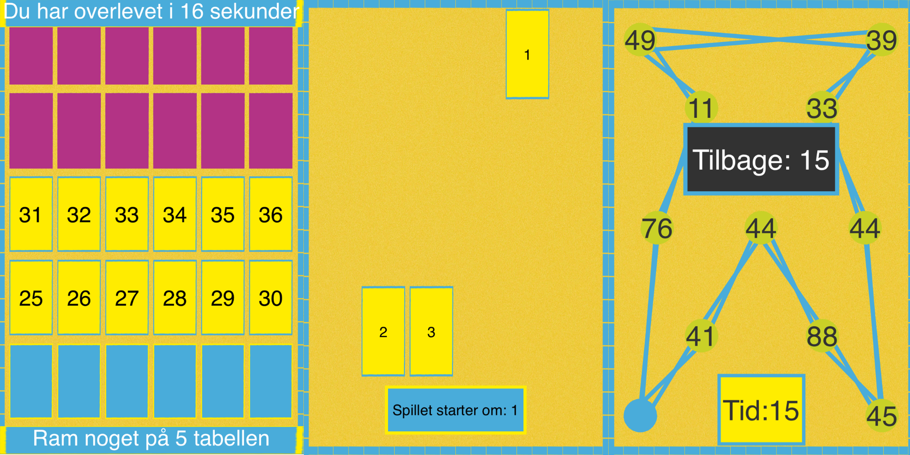

# Brain based smartphone web-games

I made three small games aimed at kids that asked them to perform different
cognitive tasks. The games uses [processing.js](http://processingjs.org) and
runs on any smartphone. The games can be found at this url:
[rotendahl.dk/games/brain](http://rotendahl.dk/games/brain)

### The platform
The games consist of _.pde_ files rendered to a html canvas by processing. The game
s were made responsive with the help of this repo [jProcessingJS](https://github.com/GildasP/jProcessingJS) If you want to read more about the games and more about building responsive
smartphone games with processing I've written a post about it [on my blog](http://rotendahl.dk/Processing-Games/)
